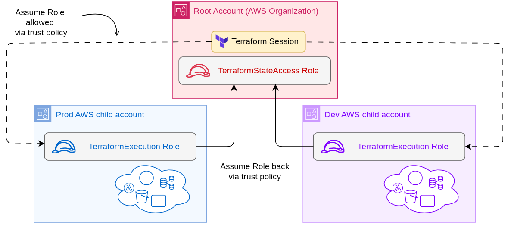

# Mindful Reflections: Terraform + Terragrunt Infrastructure


## 🚀 Getting Started

Before deploying, ensure your AWS account structure and IAM roles follow the trust-based architecture below:



> 📌 **This diagram illustrates the prerequisite setup required before running Terragrunt deployments.**

### Prerequisites for this architecture:

- **Root Account**
  - Hosts the S3 + DynamoDB backend for Terraform state and locking.
  - Contains the IAM role `TerraformStateAccess`, which allows child accounts to write backend state.
  - Contains the initial **Terraform Session** (executed locally or via CI/CD), which assumes roles in child accounts.

- **Child Accounts (`dev`, `prod`)**
  - Each has its own `TerraformExecutionRole` IAM role with permission to manage infrastructure.
  - Trusts the **root account**, allowing Terraform to `assume-role` into the environment.
  - Each execution role is also allowed to assume the `TerraformStateAccess` role back in the root account (reverse assume-role) to write backend state.

> ⚠️ You must configure these IAM roles and trust policies before using this infrastructure setup.

---

1. Clone the repo and set up your AWS Organization with dev/prod accounts.
2. Export credentials for the root account (backend hosting).
3. Deploy VPC layer:
   ```bash
   cd prod/aws/networking/vpc
   terragrunt apply
Deploy security groups and EC2:

bash
Copy
Edit
cd prod/aws/networking/security-groups-base
terragrunt apply

cd prod/aws/computing/01-prefect
terragrunt apply


This repository contains modular, production-ready infrastructure code built with **Terraform** and **Terragrunt** for provisioning AWS-based environments.

The goal is to provide a clean and scalable baseline setup for multi-account AWS organizations using best practices — including:

- clearly separated `prod` and `dev` environments,
- reusable and composable Terraform modules,
- infrastructure state isolation with S3 and DynamoDB backends,
- secure networking with VPCs, subnets, and security groups,
- flexible EC2 provisioning, including SSH key injection via `user-data`.

This setup can serve both as a learning resource and as a foundation for real-world infrastructure needs — whether you're bootstrapping a new project or exploring Terragrunt-based workflows.


---

## 🧭 Project Goals

- Design **clean, scalable, and reusable infrastructure-as-code (IaC)** for multi-account AWS environments.
- Support infrastructure bootstrapping entirely from code using **Terragrunt + Terraform**.
- Provide a learning and demonstration base for recruiters, engineers, and open-source collaborators.
- Lay the groundwork for the Mindful Reflections platform (initially running on Discord, with future plans for a full-stack web interface).

---

## 🌐 Infrastructure Highlights

- **Multi-account AWS setup** (dev/prod) using **AWS Organizations** and `assume-role` logic.
- Clear **environment structure**: each environment is isolated (e.g. `prod/aws/...`), and can be independently deployed.
- **Reverse assume-role** to allow child accounts (dev/prod) to write to S3 backend and DynamoDB state lock in the root account.
- Centralized tagging via `common_vars/general.hcl`.
- Infrastructure layers:
  - `networking`: VPC, Subnets, Security Groups
  - `computing`: EC2 (with batch or single provisioning)
  - `databases`: future modules for RDS/ClickHouse
- **User data templating** for EC2 with injected SSH keys from the Terragrunt layer.
- Compatible with **Terragrunt Stacks/Units** in v0.78+.

---

## 📂 Repository Structure

```
terragrunt-configs/
├── common_vars/              # Shared tags and settings
├── terraform-modules/        # Reusable modules
│   ├── aws/
│   │   ├── batch-ec2/
│   │   ├── batch-security-groups/
│   │   └── vpc/
│   └── simple-test/
├── dev/                      # dev account config
│   ├── aws/networking/
│   └── aws/computing/
├── prod/                     # production account config
│   ├── aws/networking/
│   └── aws/computing/
└── terragrunt.hcl            # Root Terragrunt configuration
```

---

## 🧩 Modules

| Module | Description |
|--------|-------------|
| [`batch-ec2`](terraform-modules/aws/batch-ec2/) | Launch multiple EC2 instances with user-data templating, SSH key injection |
| [`batch-security-groups`](terraform-modules/aws/batch-security-groups/) | Declarative creation of reusable Security Groups |
| [`vpc`](terraform-modules/aws/vpc/) | Base networking: VPC, subnets, NAT, Internet Gateway |

---

## 📦 Deployment Flow

Each environment (e.g. `prod/`) includes a dedicated `env.hcl`, which defines environment-specific variables such as:

```hcl
locals {
  env = "production"
  vpc_cidr = "10.20.0.0/16"
  tags = {
    Owner = "DevOps"
    Project = "MindfulReflections"
  }
}
```

Terragrunt configurations (e.g. `prod/aws/computing/01-prefect/terragrunt.hcl`) then use:

- `dependency` blocks to pull VPC/subnet info
- `include` for common settings
- `inputs` for module configuration
- dynamic logic for reading `.pub` keys from a folder and injecting them via `user_data.tpl`

---

## 🚀 Getting Started

1. Clone the repo and set up your AWS Organization with dev/prod accounts.
2. Export credentials for the root account (backend hosting).
3. Deploy VPC layer:
   ```bash
   cd prod/aws/networking/vpc
   terragrunt apply
   ```
4. Deploy security groups and EC2:
   ```bash
   cd prod/aws/networking/security-groups-base
   terragrunt apply

   cd prod/aws/computing/01-prefect
   terragrunt apply
   ```

---

## 🧹 Cleanup

To destroy everything in an environment (e.g. prod):
```bash
cd prod/aws
terragrunt run-all destroy
```

---

## 👤 Author

Developed and maintained by **Aliaksei Shybeka** for the **Mindful Reflections Project**.
Feel free to reach out or explore my profile for more DevOps and AI infrastructure content.
